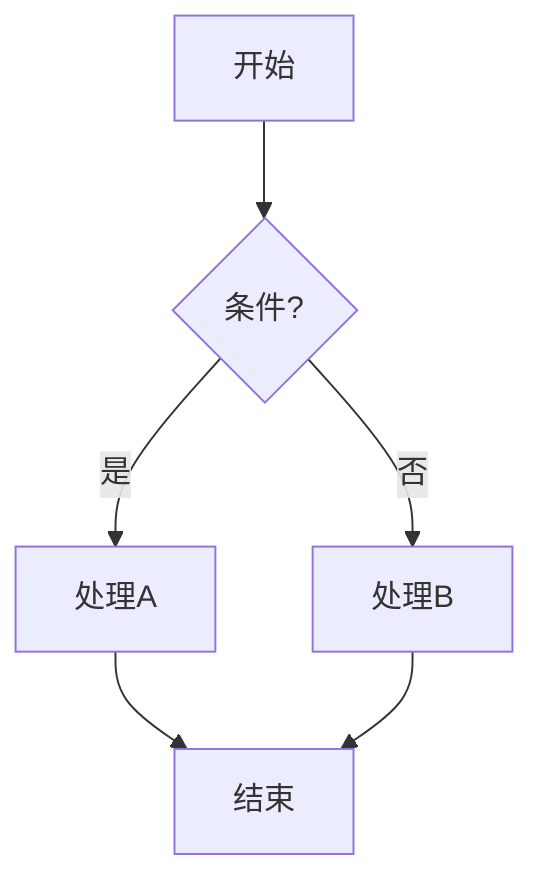
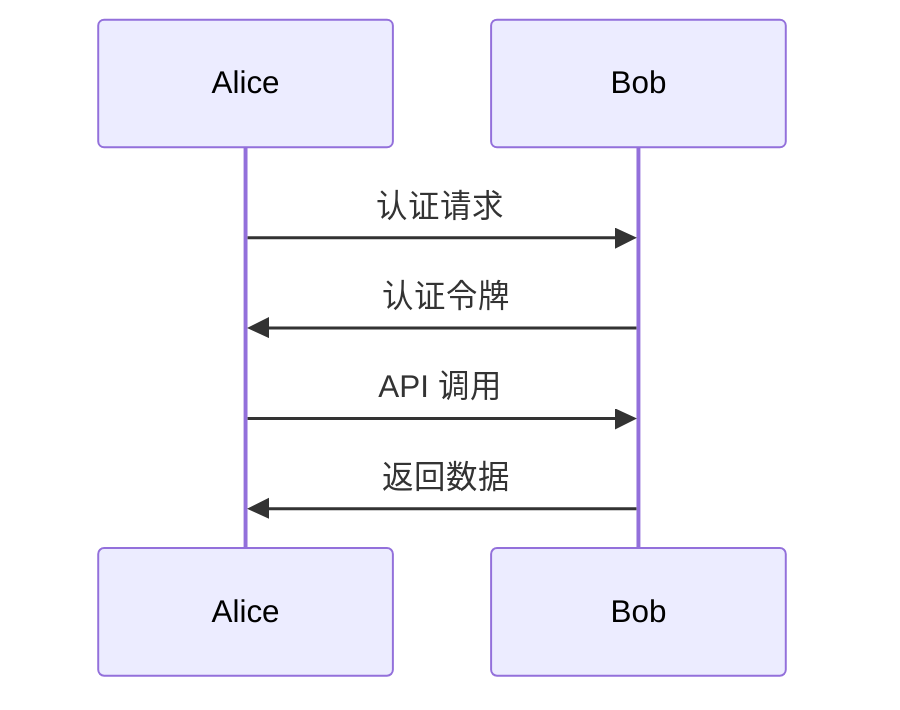
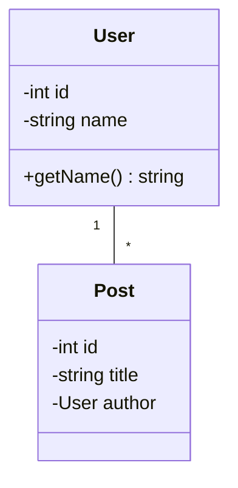

# 图片和图表渲染测试

## Mermaid 图表

## Mermaid 时序图(原 PlantUML,1:1 翻译)

## Mermaid 类图(原 PlantUML,1:1 翻译)

## 内联 SVG

<svg width="200" height="200" xmlns="http://www.w3.org/2000/svg">
  <rect width="200" height="200" fill="#f0f0f0"/>
  <circle cx="100" cy="100" r="80" fill="#3498db"/>
  <text x="100" y="105" text-anchor="middle" fill="white" font-size="20">SVG Test</text>
</svg>

## 网络图片 - Wikipedia Logo

## 本地相对路径图片示例

 <!-- 演示路径引用，实际不存在 -->

---

**测试步骤：**

1. `:RenderMarkdown` - 开启渲染（如果已启用可跳过）
2. `,mb` - 在浏览器中预览（live-preview.nvim）
3. 观察各种图表/图片的渲染效果
